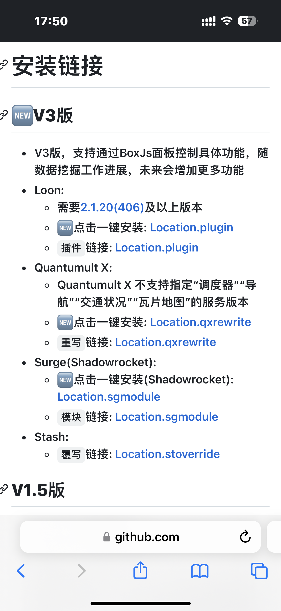
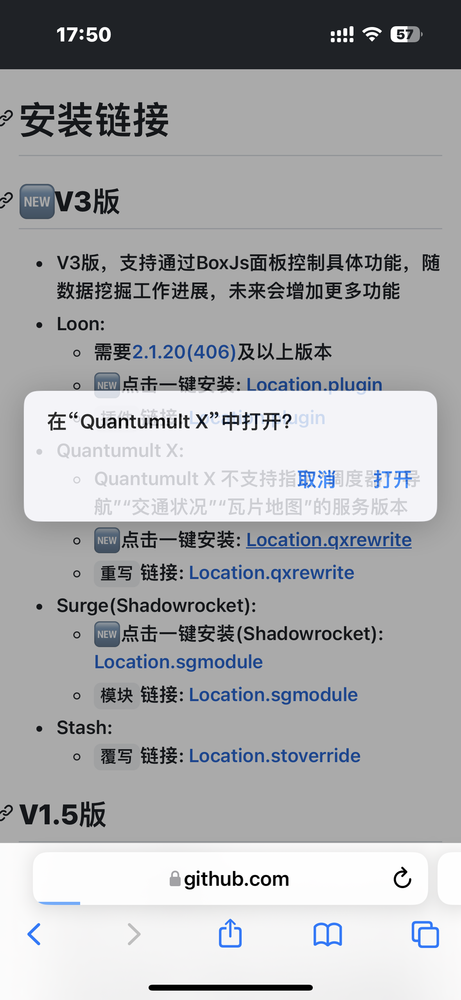
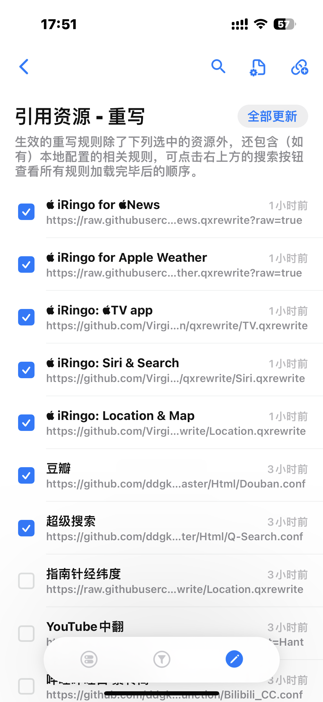

### iRingo 使用教程；shadowrocket 小火箭、Quantumult X
机型：14Pro       IOS：16.4.1

机型：iPad Pro 2020      iPad OS：忘记了（使用的当前最新系统，今天是2023-04-21）

#### 更新 关于Quantumult X（2023-06-02)
第一次用了 QuanX，觉得QuanX会比小飞机好用一些。

因为QuanX中带有复写功能 (这个功能我在小飞机中没有看到，不知道我是不是不会用哈)
个人猜测：小飞机中使用boxjs的原因是因为它没有复写功能，使用boxjs来代替。

#### 在QuanX的使用iRingo模块
QuanX的使用步骤很特别简单
只需要在对应的模块简介中 点击QuanX的一键订阅。即可

在QuanX中打开

等待QuanX导入成功之后重新开启一次代理即可使用。

有几个需要注意的地方
1. 如果设备中有 SIM 卡：定位&地图 模块首次加载需要 开飞行模式 或者拔卡。然后正常刷新 左下角高德地图的步骤操作。
2. 天气模块如果没有配置三方地图的 key，则无法加载天气数据。
3. 如果设备中有 SIM 卡：News 会被检测，需要在没有SIM卡 或者 飞行模式下使用（如果有WiFi可   即用即开，使用的时候打开飞行模式即可）

除以上几个问题之外，其他功能均正常使用。

-----------------------------------------

#### 1. 在 [iRingo](https://github.com/VirgilClyne/iRingo) 项目主页找到 [🧰BoxJs](https://github.com/VirgilClyne/iRingo/wiki/%F0%9F%A7%B0-BoxJs) 点击蓝色字体进入介绍

#### 2. 点击 使用说明中 [BoxJs官方说明文档](https://docs.boxjs.app/) 进入 boxjs 官网说明文档页面

#### 3. 在官方文档找到自己使用的 🪜代理软件，按照官方说明提示进行安装。
**部分app 支持一件安装。安装后 重新开启一次代理**

一键安装 -> 打开

在代理app 中打开后会自动安装并启用 boxjs。（如未启用，请手动启用该模块）

#### 4. 在 [iRingo 主页](https://github.com/VirgilClyne/iRingo) 找到你想要使用的功能，点击 [简介](https://github.com/VirgilClyne/iRingo/wiki/%F0%9F%94%8D-Siri%E4%B8%8E%E6%90%9C%E7%B4%A2#%E7%AE%80%E4%BB%8B)

#### 5. 在简介中找到版本信息，在版本信息中点击对应 代理软件 一键安装连接进行安装。（和 boxjs 安装流程相同）

#### 6. 再回到 [iRingo 主页](https://github.com/VirgilClyne/iRingo) 点击 [🧰BoxJs](https://github.com/VirgilClyne/iRingo/wiki/%F0%9F%A7%B0-BoxJs) 介绍
点击[iRingo](http://boxjs.com/#/sub/add/https%3A%2F%2Fgithub.com%2FVirgilClyne%2FiRingo%2Fblob%2Fmain%2Fbox%2FiRingo.boxjs.json%3Fraw%3Dtrue) 订阅连接 会自动将订阅添加到BoxJs中

添加成功

#### 7. 在boxjs中 点击底部 `应用`，切换到 iRingo 应用列表, 并在列表中点击需要使用的模块

#### 8. 模块默认是启用的，在应用配置中 
  1. 点击右下角 `保存` 按钮（如需要关闭部分模块，取消勾选上方选项后点击保存）
  
  2. 保存后会更新 `当前会话` 中的 `@iRingo.xx.Settings`, 在`当前会话` 框中点击右下角的 `克隆` 按钮。
  
  3. 克隆 `当前会话` 后，会在 `当前会话` 下面创建一个 子会话，在子会话中点击 `应用` 按钮保存当前模块设置
  

#### 9. 在代理软件中，将代理模式更改为全局模式（小飞机 中应该叫 ‘代理’）。
如果 手机/ipad 中装有SIM卡，则需要开启飞行模式

#### 10. 打开系统自带`地图`应用
搜索并定位到 london（伦敦）（这一步骤应该是更新手机定位设置，不一定是伦敦）
等待左下角 `高德地图` 图标消失 (这一步骤，应该代表定位信息更新完成)

这一步骤时间可能会久一点（应该与网络有关），基本在地图 重新加载完成后`高德地图`会消失

图标消失后就代表已经成功了（好像要一直保持全局代理模式，我也不确定，我现在是这样）
（
2024-07-30： 经反馈发现一些问题，如果开了全局代理，那有没有开启模块都可以使用国际版Siri等功能。
  所以 第9步骤 应当使用 规则转发/配置 模式 -> 重启手机后再进行后续操作。
  
  现在一直在使用Quantumult X，不使用 boxjs即可使用以上模块，配置功能比较简单（我使用过的app），如果有条件可以尝试代替 shawodrocket。
  最近也没怎么折腾这些东西，目前 国际版 Siri可用，其他模块不可用。

  另外 最近不怎么上 GitHub 所以不能够及时回复。

  有些问题，我也只是自己摸索得出结论，未经过深度验证。
  我对此原理也是知之甚少，我也欠缺深度思考，有时需要他人提出疑问/问题，我才能能反思。
）

成功后就可以关闭飞行模式了（如果开启）

#### 11. 下面就可以验证是否成功了，简单的验证就是
打开 `指南针` 查看是否有 海拔，经纬度等信息显示；

或者 `Apple News` app查看是否能够使用；

#### 12. Siri搜索（聚焦搜索｜Spotlight）不能使用的问题。
 Siri搜索出现这个内容才可以使用更多内容。
 

如果不能够解锁更多功能/没有出现上图洁面。
只要`重启` 设备后再打开 Siri搜索就可以出现上图提示.(我是iPad这样的)

重启后记得 先开启/连接代理（我设置了开机自启动）。
小飞机始终开启：设置 -> 按需求连接 -> 始终开启
